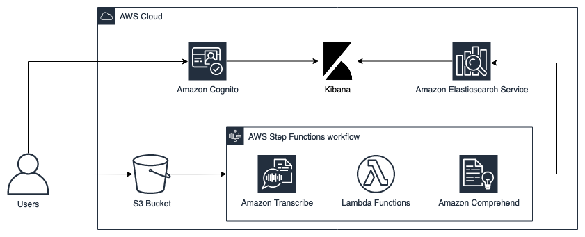
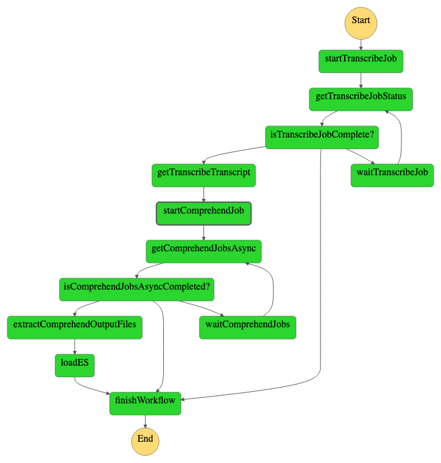

# Serverless Audio Indexing

This repository contains the code supporting the blog post "Indexing Audio with Amazon Transcribe, Amazon Comprehend and ElasticSearch". It shows a simple AWS architecture of how automatically index audio files uploaded on a S3 bucket. The solution leverages AWS Step Functions, AWS Lambda Amazon, Transcribe, Amazon Comprehend and Amazon ElasticSearch. The code on this repository supports the blog post [Indexing Audios with Amazon Transcribe, Amazon Comprehend and ElasticSearch](https://aws.amazon.com/pt/blogs/aws-brasil/indexando-audios-com-amazon-transcribe-amazon-comprehend-e-elasticsearch/)

## Architecture
The following architecture was built to index audio files ingested on S3 bucket.  



## Workflow Overview
The solution step function workflow has the following macro activities:
1. Start the transcribe job: starts an asynchronous transcribe job using the audio uploaded on the S3 bucket;
2. Get Transcribe Job Status: get the the previous step job status and checks if has finished or failed;
3. Start Comprehend Job: starts an asynchronous Compherend job using the transcription file generated on the step 1. The jobs analyze Sentiment and entities of the file;
4. Get Comprehend Job Status:  get the the previous step job status and checks if has finished or failed;
5. Load to ES: load the documents generated by comprehend into the ElasticSearch cluster.

## Setup
### Prerequisites
1. Configure the AWS Credentials in your environment. Refer to [Configuration and credential file settings](https://docs.aws.amazon.com/cli/latest/userguide/cli-configure-files.html);
2. Download and install AWS CLI. Refer to [Installing the AWS CLI](https://docs.aws.amazon.com/cli/latest/userguide/cli-chap-install.html);
3. Download and install AWS SAM CLI. Refer to [Installing the AWS SAM CLI](https://docs.aws.amazon.com/serverless-application-model/latest/developerguide/serverless-sam-cli-install.html);
4. Download and install Docker. Refer to [Docker](https://www.docker.com/products/docker-desktop).

### Deploy
Run the commands below to deploy the architecutre. It creates a CloudFormation stack with all components and a working workflow.

```
sam build --use-container && sam deploy --guided
```
To launch the stack, the following parameters are required:
Parameter name         |Description                                                   |AllowedPattern/Values                                                |
:----------:|:---------------------------------------------------------------:|:----------------------------------------------------------------------:|
ElasticsearchDomainName     |Name used on the domain of the Elasticsearch cluster    | [a-z][a-z0-9]* |
SourceAudioLanguage       |Source Language of the audio files                                          | Supported Values: <br />‘de-DE’ German <br />‘de-CH’ Swiss German <br />‘en-AU’ Australian English <br />‘en-GB’ British English <br />‘en-IN’ Indian English <br />‘en-IE’ Irish English <br />‘en-AB’: Scottish English <br />‘en-US’: US English <br />‘en-WL’ Welsh English <br />‘es-ES’ Spanish <br />‘es-US’ US Spanish <br />‘it-IT’ Italian <br />‘pt-PT’ Portuguese <br />‘pt-BR’ Brazilian Portuguese <br />‘fr-FR’ French <br />‘fr-CA’ Canadian French <br />‘ja-JP’ Japanese <br />‘ko-KR’ Korean <br />‘hi-IN’ Hindi <br />‘ar-SA’ Arabic <br />‘zh-CN’ Chinese (simplified)                                                                   |                               

### Running the workflow
After the launch of the stack, the following outputs will be generated: `RawBucket`, `UserPoolId`, `UserPoolArn`, `IdentityPoolId`, `RawBucket`, `MainBucket`, `TranscribeS3Bucket` and `StepFunction`. To start the workflow, it's necessary to upload a `.mp3` or `.mp4` file on the  `RawBucket`, doing so, the workflow will be started.

We can track the execution of the workflow on the `StepFunction` resource:


## Clean up (Optional)
If you don't want to continue using the application, take the following steps to clean up its resources and avoid further charges;
1. Sign in to the AWS Management Console and open the Amazon S3 console at [https://console.aws.amazon.com/s3](https://console.aws.amazon.com/s3);
2. In the **Bucket name** list, select the option that has *RawS3Bucket* on the name and then choose **Empty**;
3. On the **Empty bucket** page, confirm that you want to empty the bucket by entering the bucket name into the text field, and then choose **Empty**;
4. Repeat the process for the bucket that contains *MainS3Bucket* and *TranscribeS3Bucket* on the name
5. Open the AWS CloudFormation console at [https://console.aws.amazon.com/cloudformation](https://console.aws.amazon.com/cloudformation);
6. On the **Stacks** page in the CloudFormation console, select the stack you deployed during the Deploy setup;
7. In the stack details pane, choose **Delete**.

## Security

See [CONTRIBUTING](CONTRIBUTING.md#security-issue-notifications) for more information.

## License

This library is licensed under the MIT-0 License. See the LICENSE file.